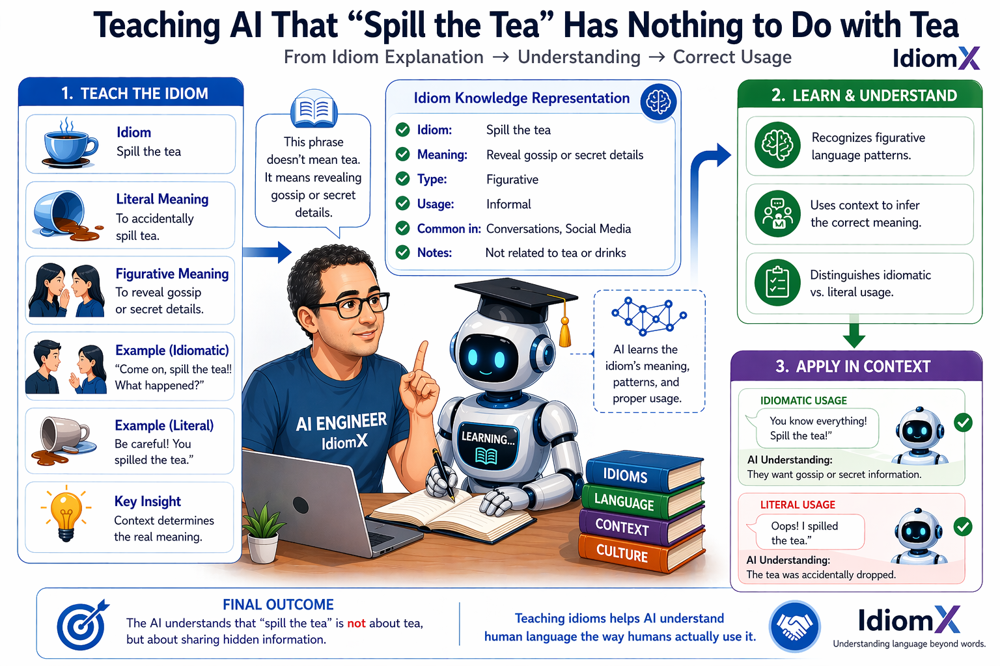
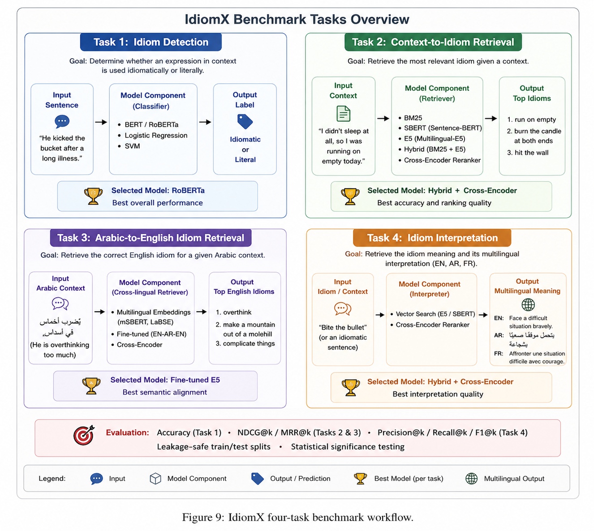

# IdiomX: A Multilingual Benchmark for Idiom Understanding, Retrieval and Semantic Interpretation

[](...)
[](https://huggingface.co/datasets/aymansharara/IdiomX)
[](https://huggingface.co/spaces/aymansharara/idiomx-studio)
[](https://www.kaggle.com/datasets/aymansharara/idiomx)
[](LICENSE)

<p align="center">
  
</p>

> Teaching AI that *“spill the tea”* has nothing to do with tea.

---

## Overview

Understanding idiomatic language remains a major challenge in NLP due to its non-literal and context-dependent nature.

IdiomX introduces a unified benchmark framework for idiom understanding, spanning idiom detection, semantic retrieval, cross-lingual alignment, and multilingual idiom interpretation.

This repository focuses on:
- evaluating idiom understanding tasks
- building reproducible deep learning pipelines
- demonstrating practical inference systems

> This repository focuses on benchmarking and modeling.  
> Dataset construction is described separately.

**Dataset Snapshot**  
📊 190K+ examples • 🧠 12K+ idioms • 🌍 3 languages • 🎯 4 benchmark tasks

---

## Dataset

We use the high-quality final IdiomX dataset and release the full construction pipeline publicly:

Resources:
- 🤗 Hugging Face Dataset  
https://huggingface.co/datasets/aymansharara/IdiomX

- 📊 Kaggle Dataset  
https://www.kaggle.com/datasets/aymansharara/idiomx

- ⚙️ Dataset Construction Pipeline (GitHub)  
https://github.com/aymanshar/idiomx-dataset

- 🧠 Models and Benchmarks (GitHub)  
https://github.com/aymanshar/IdiomX

The dataset includes:
- English idioms with contextual examples
- Arabic translations and semantic alignment
- French translations and semantic alignment
- idiomatic vs literal labels
- multiple examples per idiom

Although this repository focuses on benchmarking and models, the full data collection, enrichment, validation, and dataset construction pipeline is available in the separate IdiomX dataset repository.

---

## Repository Structure

```
	IdiomX/
	│
	├── data/
	│
	├── notebooks/
	│   ├── idiomx_dataset_analysis.ipynb
	│   ├── Task1_idiom_detection_Benchmark.ipynb
	│   ├── Task1_idiom_detection_Demo.ipynb
	│   ├── Task2_Context_to_Idiom_Benchmark.ipynb
	│   ├── Task2_Context_to_Idiom_Demo.ipynb
	│   ├── Task3_Arabic_Semantic_Retrieval_Benchmark.ipynb
	│   ├── Task3_Arabic_Semantic_Retrieval_Demo.ipynb
	│   ├── task4_idiom_meaning_retrieval_Benchmark.ipynb
	│   └── task4_idiom_meaning_retrieval_Demo.ipynb	
	│
	├── figures/
	│
	├── artifacts/
	│   ├── task1/
	│   ├── task2/
	│   ├── task3/
	│   └── task4/
	│
	├── paper/
	│
	└── README.md
```
---
## Loading the Dataset
 
Example loading from Hugging Face:

```python
# 1.1 load datasets
from datasets import load_dataset
import pandas as pd

# Full dataset load
HF_DATASET_NAME = "aymansharara/IdiomX"
HF_CONFIG_NAME = "idiomx_full"

dataset = load_dataset(HF_DATASET_NAME, HF_CONFIG_NAME)
df_raw = dataset["full"].to_pandas()

# task2 idiomx retrieval dataset load
HF_DATASET_ID = "aymansharara/IdiomX"
CONFIG_NAME = "task2_idiomx_retrieval_dataset"

dataset = load_dataset(HF_DATASET_ID, CONFIG_NAME)
df = dataset[list(dataset.keys())[0]].to_pandas()

```

For the full data collection and enrichment pipeline, see:  
https://github.com/aymanshar/idiomx-dataset

---

## Benchmark Tasks

IdiomX defines a progressive 4-task benchmark pipeline for idiomatic language understanding, moving from recognition to retrieval to semantic interpretation.

### Four-Task Benchmark Pipeline

<p align="center">
  
</p>

---

### Task 1 — Idiom Detection
Goal: determine whether an expression in context is used idiomatically or literally.

Input:
- sentence containing an expression

Output:
- idiomatic / literal label

Models:
- TF-IDF + Logistic Regression
- DistilBERT
- RoBERTa (best performing)

Example:

Literal:
She spilled the tea on the floor.

Idiomatic:
She spilled the tea about the meeting.

Focus:
- contextual disambiguation
- figurative language detection

---

### Task 2 — Context → Idiom Retrieval
Goal: given a sentence, retrieve the idiom that best matches the meaning.

Input:
- contextual sentence

Output:
- ranked idiom candidates

Retrieval Pipeline:
- Dense retrieval (MiniLM)
- BM25 lexical retrieval
- Hybrid retrieval
- Cross-encoder reranker
- Fine-tuned reranker

Example:

Input:
He finally revealed the secret.

Prediction:
spill the beans

Focus:
- semantic retrieval
- context to idiom mapping

---

### Task 3 — Arabic Context → English Idiom Retrieval
Goal: retrieve the correct English idiom from Arabic context.

Input:
- Arabic contextual sentence

Output:
- ranked English idioms

Models:
- Multilingual MiniLM
- Multilingual E5
- Fine-tuned E5 (best)

Example:

Input:
كشف السر بدون قصد

Prediction:
spill the beans

Focus:
- cross-lingual semantic alignment
- multilingual idiom retrieval

---

### Task 4 — Idiom Interpretation
Goal: retrieve and explain idiomatic meaning in multiple languages.

Input:
- idiom or idiomatic sentence

Output:
- canonical idiom
- English meaning
- Arabic meaning
- French meaning

Example:

Input:
spill the tea

EN:
Reveal gossip or personal secrets.

AR:
كشف الشائعات أو الأسرار.

FR:
Révéler des potins.

Models:
- Dense retrieval
- Hybrid retrieval
- Hybrid + reranker (best)

Focus:
- semantic grounding
- explainable idiom understanding
- multilingual interpretation

---

## Unified Benchmark Progression

The four tasks form one pipeline:

Task 1  
Expression Detection  
(sentence → idiomatic or literal)

↓

Task 2  
Contextual Retrieval  
(context → idiom)

↓

Task 3  
Cross-Lingual Retrieval  
(Arabic context → English idiom)

↓

Task 4  
Idiom Interpretation  
(idiom/context → multilingual meaning)

This progression moves from:
- detection  
- retrieval  
- cross-lingual alignment  
- explainable semantic interpretation

---

# Interactive IdiomX Studio (Main Demo)

## Live Demo
https://huggingface.co/spaces/aymansharara/idiomx-studio

---

## Installation

```bash
git clone https://github.com/aymanshar/IdiomX
cd IdiomX
pip install -r requirements.txt
```

The repository includes all dependencies for:
- Task 1: Idiom Detection
- Task 2: Context-to-Idiom Retrieval
- Task 3: Arabic-to-English Retrieval
- Task 4: Idiom Interpretation

See `requirements.txt` for the complete environment.

---

## Benchmark Summary

| Task | Best Model | Main Metric | Result |
|------|------------|-------------|--------|
| Task 1: Idiom Detection | RoBERTa | Accuracy / F1 | 92.6% |
| Task 2: Context → Idiom | Hybrid + Fine-Tuned Reranker | Top-1 | 88.5% |
| Task 3: Arabic → English Idiom | Fine-Tuned E5 | Top-1 | 57.8% |
| Task 4: Idiom Interpretation | Hybrid + Reranker | Top-1 | 67.4% |

**Highlights**
- Strong transformer performance for idiom detection  
- Hybrid retrieval consistently outperforms dense-only baselines  
- Fine-tuning substantially improves cross-lingual retrieval  
- Task 4 introduces explainable idiom meaning retrieval

See full benchmark details in:
- paper/
- notebooks/
- Hugging Face demos

---

## Reproducibility

This repository is designed to be:

- fully reproducible  
- notebook-driven  
- easy to experiment with  

Two usage modes:
- full experiment reproduction  
- lightweight inference demos  

---

## Research Paper

The full research paper is available in:
paper/

---

## Limitations

- performance depends on clarity of input context  
- open-ended sentences may return related idioms instead of exact matches  
- reranker operates on top-k candidates (not full search space)  

---

## Citation

If you use IdiomX in your research, please cite:

@dataset{idiomx2026,
title={IdiomX: A Multilingual Benchmark for Idiom Understanding, Retrieval and Semantic Interpretation},
author={Sharara, Ayman},
year={2026}
}

---
## Final Note

IdiomX aims to push forward research in:
- figurative language understanding  
- multilingual NLP  
- semantic reasoning  

If you find this project useful, consider starring the repository.
---